# Symphony Agent - Arquitectura Técnica

## Resumen

Symphony Agent es el orquestador autónomo de desarrollo para los proyectos Narobial. Ejecuta un loop principal cada 5 minutos y delega la resolución en Kiro, con fallback a Codex.

### Estado operativo verificado (2026-07-15)

- Loop y solver: operativo.
- Auditoría, cobertura y mutation testing: operativos con dependencias externas.
- Documentación: timer deshabilitado; docs-detector crea issues sin modificar código.
- Telemetría por issue: parcial; escribe JSONL en AGENT_TELEMETRY_FILE.
- Terminación: grupo de procesos con SIGTERM y SIGKILL tras 10 segundos.
- Informe de proyectos: valida resultado, código y fecha de salida.

| Atributo | Valor |
| --- | --- |
| Servidor | 95.39.37.37 |
| Ruta | /home/gcalleja/code/symphony/agent |
| Runtime | Node.js, TypeScript, tsx |
| Servicio principal | symphony-agent.service |
| Agente IA ejecutor | kiro-cli con narobial-frontend |
| Repositorio principal | Narobial/Narobial-Frontend |
| Rama base frontend | hotfix-master |
| Deploy preview | Docker + nginx + SSL en qdevweb.intraquiter |

## Vista General

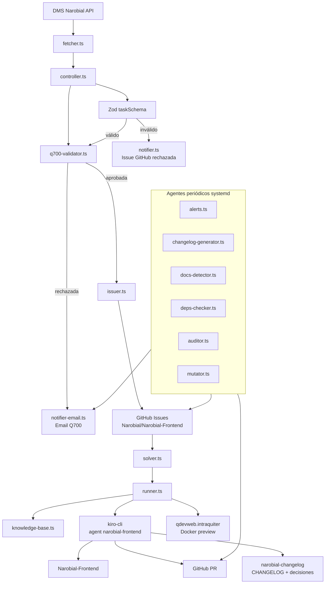

## Repos Gestionados

| Repo | Uso | Rama principal esperada |
| --- | --- | --- |
| `Narobial/Narobial-Frontend` | Aplicación Angular principal, implementación de incidencias y proyectos | `hotfix-master` |
| `Narobial/narobial-changelog` | Registro de cambios, release notes y decisiones técnicas | `main` |
| `Narobial/narobialAdmin-Frontend` | Panel de administración | `main` |
| `Narobial/narobial-docs` | Documentación | `main` |

La sincronización se hace en `repos.ts`. Si un repo ya existe en `REPOS_DIR`, se intenta cambiar a `hotfix-master` y, si no existe, a `main`, antes de ejecutar `git pull --ff-only`. Si no existe, se clona desde GitHub.

## Loop Principal

El proceso principal vive en `src/index.ts`. Arranca con `dotenv/config`, ejecuta un `tick()` inmediato y después repite el ciclo cada `5 * 60_000` ms.

```mermaid
flowchart TD
    Start([Inicio service]) --> Tick[tick()]
    Tick --> Sync[syncRepos()]
    Sync --> Fetch[fetchTasks()]
    Fetch --> Filter{--only definido?}
    Filter -->|sí| Only[Filtrar por ID]
    Filter -->|no| Process
    Only --> Process[processTask() por tarea]
    Process --> ValidateSchema{Schema Zod válido?}
    ValidateSchema -->|no| SchemaReject[Crear issue de rechazo]
    ValidateSchema -->|sí| ValidateQ700{Q700 aprobada?}
    ValidateQ700 -->|no| EmailReject[Enviar email Q700]
    ValidateQ700 -->|sí| CreateIssue[Crear issue GitHub]
    SchemaReject --> Solve[solveIssues()]
    EmailReject --> Solve
    CreateIssue --> Solve
    Solve --> Eligible[Buscar issues elegibles]
    Eligible --> Score[Calcular prioridad]
    Score --> Batch[Tomar slots disponibles]
    Batch --> Run[runAgent()]
    Run --> Sleep[Esperar 5 minutos]
    Solve --> Sleep
    Sleep --> Tick
```

### Modos de ejecución

| Comando | Uso |
| --- | --- |
| `npx tsx src/index.ts` | Producción bajo systemd |
| `npx tsx src/index.ts --only P05942026ES` | Procesar solo una incidencia concreta |
| `npx tsx src/index.ts --user gcalleja` | Sobrescribir `DMS_SEARCH_VALUE` |
| `npm run dev` | Atajo actual para `tsx src/index.ts --only P05942026ES` |
| `npm run dev:all` | Atajo para `tsx src/index.ts` |

## Componentes del Orquestador

### `config.ts`

Centraliza la configuración cargada desde variables de entorno. La función `env()` falla rápido si falta una variable obligatoria.

Responsabilidades:

- Configuración del DMS: URL, token, cliente, método, entidad, filtros.
- Configuración de GitHub: repo destino y usuario asignado.
- Configuración de repos locales: `REPOS_DIR`, `FRONTEND_REPO_DIR`.
- Configuración de solver: concurrencia, comando de agente y label de procesamiento.
- Configuración de deploy: host, clave SSH y comando de build.

Relaciones:

- Es importado por todos los módulos que llaman DMS, GitHub, repos locales, deploy o email indirectamente.
- Los scripts periódicos lo usan para resolver rutas y repos.

### `fetcher.ts`

Extrae incidencias abiertas del DMS de Narobial.

Cómo funciona:

1. Hace una petición `POST` a `DMS_URL`.
2. Añade headers requeridos por la API: `access-token`, `ClientId`, `metododms`, `entidadDms`, `methodtype`, `servercode`, `headers`, `custominterface`.
3. Envía `queryParams.searchValue` y `queryParams.isOpened`.
4. Devuelve `data.procedures` si es un array; en caso contrario devuelve una lista vacía.

Config relevante:

| Variable | Descripción |
| --- | --- |
| `DMS_URL` | Endpoint DMS |
| `DMS_ACCESS_TOKEN` | Token de acceso |
| `DMS_CLIENT_ID` | Cliente API |
| `DMS_SEARCH_VALUE` | Usuario/filtro de búsqueda |
| `DMS_IS_OPENED` | Filtro de incidencias abiertas |

### `schema.ts`

Define `taskSchema` con `zod`. El esquema normaliza campos esperados del DMS y permite que algunos sean opcionales.

Campos clave:

- `id`, `title`, `requirements`
- `countryId`, `brandId`, `customerId`
- `isProject`, `isOpened`, `isClosed`, `isNarobial`
- `customerRequirements`, `statusId`, `userCode`
- `analystDeveloperId`, `projectManagerId`, `creationDate`

### `controller.ts`

Orquesta la validación por tarea.

Flujo:

1. Valida el raw task con `taskSchema.safeParse()`.
2. Si falla el schema, llama a `notifyRejection()` para crear una issue de rechazo.
3. Si el schema es válido, ejecuta `validateQ700()`.
4. Si Q700 rechaza, llama a `notifyRejectionEmail()`.
5. Si Q700 aprueba, llama a `createIssue()`.

Relaciones:

- Entrada: objetos crudos de `fetcher.ts`.
- Salida: issues GitHub accionables o notificaciones de rechazo.

### `q700-validator.ts`

Validador de calidad de incidencias. Rechaza incidencias incompletas, ambiguas o contradictorias antes de que lleguen al solver.

Checks actuales:

| Campo | Regla |
| --- | --- |
| `requirements` | No vacío y mínimo de longitud accionable |
| `countryId` | País requerido |
| `brandId` | Marca requerida |
| `customerId` | Cliente requerido |
| `requirements` | Detección de contradicciones obvias |
| `requirements` | Detección de textos demasiado genéricos |
| `customerRequirements` | Si existe, debe tener sustancia mínima |

Salida:

```ts
{
  status: "APROBADA" | "RECHAZADA",
  reason: string,
  missingOrInconsistent: string[],
  recommendedAction: string
}
```

### `issuer.ts`

Crea issues GitHub estructuradas para que el agente pueda resolverlas sin reinterpretar el DMS.

Responsabilidades:

- Normalizar texto DMS reemplazando separadores `²²` y `²`.
- Evitar duplicados buscando el ID en título o cuerpo.
- Construir labels: `bug`, `NAROBIAl`, `ai-generated`, `country:*`, `customer:*`, `brand:*`, `project`, `status:*`.
- Crear labels faltantes cuando es posible.
- Crear issue con cuerpo estructurado: requisitos, traducción para agente, criterios de aceptación, contexto cliente y datos origen.
- Asignar issue type `Feature` o `Bug` por GraphQL.
- Vincular rama con `gh issue develop`.
- Actualizar estado por labels: `status:en-desarrollo`, `status:desarrollado`, `status:en-revision`.

Relaciones:

- Consumido por `controller.ts` para crear issues.
- Consumido por `runner.ts` para linkar rama y estado.

### `solver.ts`

Prioriza issues abiertas y lanza agentes de forma concurrente.

Selección:

- Lista hasta 50 issues abiertas con `gh issue list`.
- Excluye labels: `agente-trabajando`, `rechazada`, `en-revision`, `done`.
- Evita duplicar issues ya presentes en el set `running`.
- Respeta `MAX_CONCURRENT_AGENTS`.

Scoring:

| Señal | Impacto |
| --- | --- |
| `critical` | +50 |
| `high` | +30 |
| `bug` | +20 |
| `audit:security` | +40 |
| `country:*` | +10 por label |
| `customer:*` | +5 por label |
| Hotspot por módulo | Hasta +30 |
| Body corto | +10 |
| Body muy largo | -5 |

Salida:

- Añade label de procesamiento.
- Llama a `runAgent(issue.number, issue.title, issue.body, "hotfix-master")`.

### `knowledge-base.ts`

Busca resoluciones similares en `narobial-changelog/decisiones/frontend`.

Cómo funciona:

1. Lee archivos `.md` de decisiones.
2. Tokeniza título y contenido.
3. Tokeniza título y body de la issue actual.
4. Puntúa coincidencias exactas y parciales.
5. Devuelve hasta 3 decisiones con score suficiente.

Uso:

- `runner.ts` inserta el contexto en el prompt del agente.
- Ayuda a reutilizar decisiones previas sin convertirlas en reglas rígidas.

### `runner.ts`

Ejecuta el trabajo real sobre `Narobial-Frontend`.

Flujo:

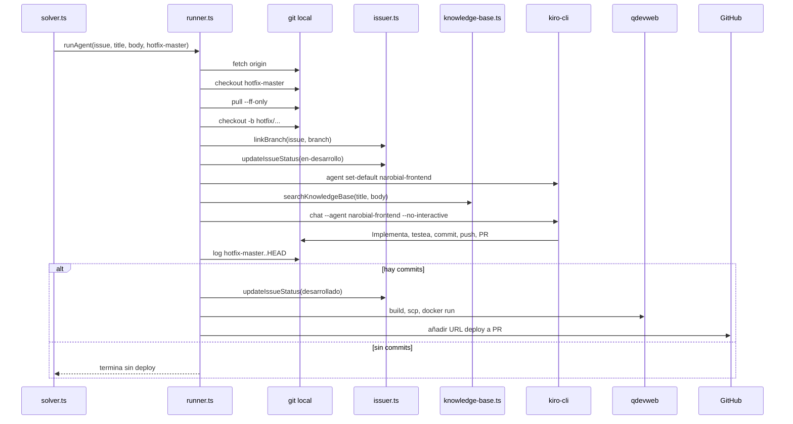

Construcción de rama:

- IDs tipo `P05942026ES` o `Q12342026ES`: `hotfix/0594-2026-ES`.
- IDs tipo `1448-2026-ES`: `hotfix/1448-2026-ES`.
- Fallback: slug del título.

Prompt al agente:

- Leer `AGENTS.md` e `INSTRUCTIONS.md`.
- Ejecutar `npm run test:unit:profile`.
- Respetar design system `nb-`, traducciones y CSS variables.
- Cubrir `null`, `undefined`, vacío, loading y error.
- Ejecutar `npm run test:unit:staged` y `npm run test:unit:branch:coverage`.
- Crear PR contra `hotfix-master`.
- Registrar cambio en `narobial-changelog`.

Deploy preview:

1. `npm run ${DEPLOY_BUILD_CMD}` en el frontend.
2. Empaqueta `dist/narobial`, nginx config y certificados.
3. Sube el tar a `root@${DEPLOY_HOST}` con `scp`.
4. Crea una imagen `nginx:1.29-alpine`.
5. Arranca contenedor `nf-<branch>` en un puerto libre desde `17000`.
6. Añade `https://${DEPLOY_HOST}:${port}` al body de la PR.

### `notifier.ts`

Crea una issue GitHub cuando una tarea no cumple el schema técnico.

Salida:

- Título: `[Rechazada] Tarea <id>`.
- Label: `rechazada`.
- Assignee: `REJECT_ASSIGNEE`.

### `notifier-email.ts`

Envía emails a través de `smtp-relay.gmail.com:465` con SSL.

Uso actual:

- Rechazos Q700.
- Alertas proactivas.
- Release notes.
- Notificaciones de documentación.

Parámetros fijos actuales:

| Campo | Valor |
| --- | --- |
| From | `noreply@narobial.net` |
| To | `guillermo.calleja@narobial.net` |
| SMTP | `smtp-relay.gmail.com:465`, `secure: true` |

## Agente `narobial-frontend`

El agente ejecutor está configurado fuera de este repo en:

```text
~/.kiro/agents/narobial-frontend.json
```

Responsabilidades esperadas:

1. Leer `AGENTS.md` e `INSTRUCTIONS.md`.
2. Detectar perfil con `npm run test:unit:profile`.
3. Implementar cambios siguiendo convenciones del repo.
4. Mantener traducciones e i18n.
5. Ejecutar tests unitarios y cobertura.
6. Crear commit y push.
7. Abrir PR contra `hotfix-master`.
8. Registrar changelog y decisión técnica.

Convenciones reforzadas desde el prompt:

- Design system con prefijo `nb-`.
- Textos visibles con `| translate`.
- CSS variables en lugar de colores/espaciados hardcodeados.
- Validación de entradas y prevención de XSS.
- Specs relacionados obligatorios.

## Agentes Periódicos

### Calendario

```mermaid
gantt
    title Calendario semanal de agentes
    dateFormat  HH:mm
    axisFormat  %H:%M
    section Diario
    Alertas proactivas          :alerts, 08:30, 30m
    section Lunes
    Release notes               :changelog, 06:00, 45m
    section Miércoles
    Detector de documentación (timer deshabilitado) :docs, 07:40, 60m
    section Viernes
    Dependencias                :deps, 19:00, 90m
    section Sábado
    Auditoría de seguridad      :audit, 08:00, 90m
    section Domingo
    Mutation testing            :mutator, 04:00, 180m
```

### `alerts.ts` - Alertas proactivas

Timer: diario a las 08:30.

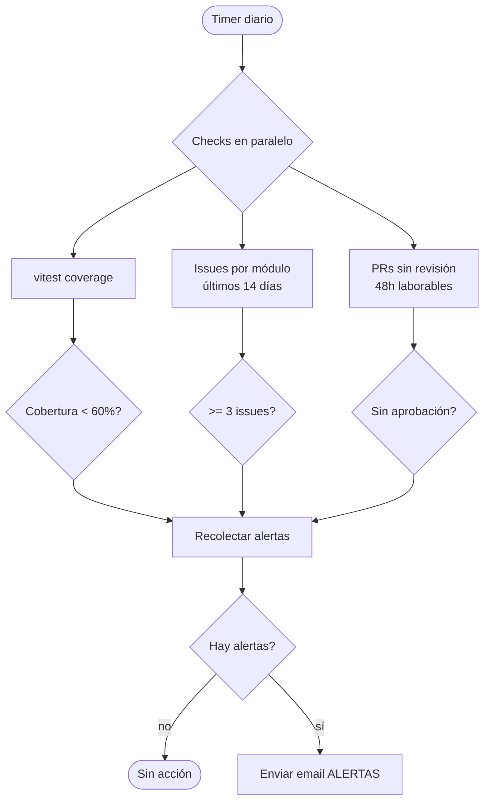

Detecta:

- Cobertura de líneas, ramas o funciones por debajo del 60%.
- Módulos con 3 o más issues abiertas en 14 días.
- PRs abiertas sin aprobación durante 48 horas laborables.

### `changelog-generator.ts` - Changelog inteligente

Timer: lunes a las 06:00.

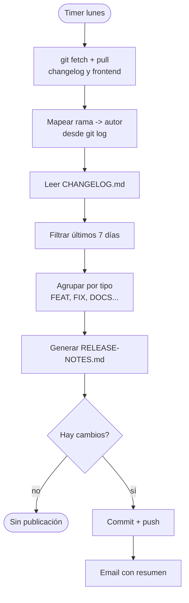

Produce:

- `RELEASE-NOTES.md` en `narobial-changelog`.
- Resumen por categoría.
- Autores inferidos desde commits y ramas.
- Email con conteo de features, fixes y contribuidores.

### `docs-detector.ts` - Detector de documentación

Timer: miércoles a las 07:40.

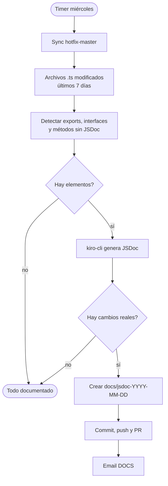

Alcance:

- Archivos `.ts` bajo `src/app/`.
- Excluye `*.spec.ts`.
- Solo busca archivos añadidos o modificados en los últimos 7 días.

Riesgo operativo:

- `kiro-cli` responde con el archivo completo modificado. Conviene revisar PRs para confirmar que no cambió lógica.

### `deps-checker.ts` - Dependencias

Timer: viernes a las 19:00.

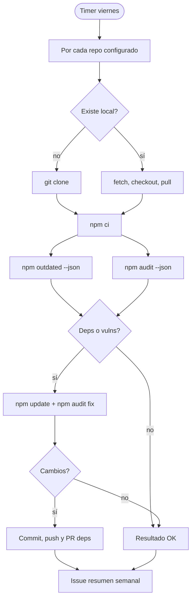

Acciones:

- Ejecuta `npm ci`.
- Detecta desactualizaciones con `npm outdated`.
- Detecta vulnerabilidades con `npm audit`.
- Aplica `npm update` y `npm audit fix` best effort.
- Abre PR con label `deps:update`.
- Crea issue resumen semanal.

### `auditor.ts` - Auditoría de seguridad y calidad

Timer: sábado a las 08:00.

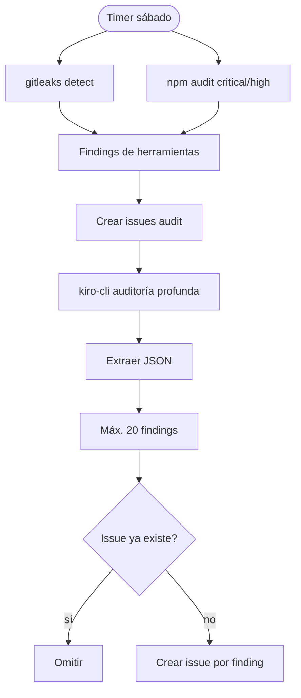

Capas:

1. `gitleaks`: secrets expuestos.
2. `npm audit`: CVEs `critical` y `high`.
3. `kiro-cli`: XSS, CSP, sanitización, memory leaks, bugs, UI, convenciones.

Labels:

- `audit`
- `audit:security`
- `audit:memory-leak`
- `audit:convention`
- `audit:bug`
- `audit:ui`

### `mutator.ts` - Mutation testing

Timer: domingo a las 04:00.

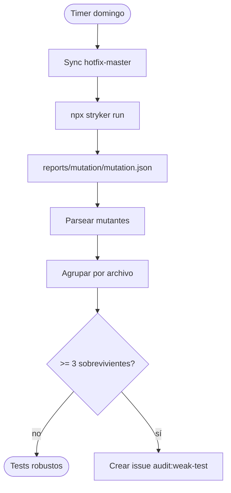

Regla actual:

- Abre issue si un archivo tiene 3 o más mutantes sobrevivientes.
- Ordena por peor score primero.
- Objetivo indicado en la issue: score >= 80%.

## Configuración

### Variables `.env`

El servicio principal carga `.env` vía `dotenv/config`. Los servicios periódicos también declaran `EnvironmentFile=/home/gcalleja/code/symphony/agent/.env`.

No se deben versionar secretos reales. `.env.example` debe usarse solo como plantilla.

#### DMS

| Variable | Obligatoria | Descripción |
| --- | --- | --- |
| `DMS_URL` | Sí | Endpoint REST del DMS |
| `DMS_ACCESS_TOKEN` | Sí | Token de acceso DMS |
| `DMS_CLIENT_ID` | Sí | Client ID usado por el DMS |
| `DMS_METODO` | No | Método DMS, default `GET.PROYECTOS` |
| `DMS_ENTIDAD` | No | Entidad DMS, default `CATALOGO` |
| `DMS_METHOD_TYPE` | No | Tipo de método, default `GET` |
| `DMS_SERVER_CODE` | No | Código servidor, default `1297` |
| `DMS_HEADERS` | No | JSON de headers internos del DMS |
| `DMS_CUSTOM_INTERFACE` | No | JSON con interfaz/campos solicitados |
| `DMS_SEARCH_VALUE` | No | Usuario/filtro de búsqueda, default `gcalleja` |
| `DMS_IS_OPENED` | No | Filtrar abiertas, default `true` |

#### GitHub

| Variable | Obligatoria | Descripción |
| --- | --- | --- |
| `GITHUB_REPO` | Sí | Repo destino en formato `owner/repo` |
| `REJECT_ASSIGNEE` | No | Usuario asignado a rechazos, PRs e issues generadas |

Requisitos externos:

- `gh auth login` ejecutado para el usuario del servicio.
- Permisos para crear issues, labels, branches y PRs.
- Issue types disponibles si se quiere asignar `Feature`/`Bug`.

#### Repos y solver

| Variable | Obligatoria | Descripción |
| --- | --- | --- |
| `REPOS_DIR` | No | Directorio local de clones, default `./repos` |
| `FRONTEND_REPO_DIR` | No | Ruta al clone de `Narobial-Frontend` |
| `MAX_CONCURRENT_AGENTS` | No | Número máximo de agentes simultáneos |
| `SOLVER_COMMAND` | No | Reservado, default `kiro` |
| `PROCESSING_LABEL` | No | Label para evitar doble ejecución |

#### Deploy

| Variable | Obligatoria | Descripción |
| --- | --- | --- |
| `DEPLOY_HOST` | No | Host qdevweb, default `qdevweb.intraquiter` |
| `DEPLOY_SSH_KEY` | No | Clave SSH, default `~/.ssh/id_ed25519` |
| `DEPLOY_BUILD_CMD` | No | Script npm para build, default `build-hotfix` |

Requisitos externos:

- Acceso SSH como `root@DEPLOY_HOST`.
- Docker disponible en qdevweb.
- Nginx config y certificados presentes en el repo frontend: `etc/default.conf`, `etc/nginx.crt`, `etc/nginx.key`.

### systemd

#### Servicio principal

| Unit | Tipo | Propósito | Comando |
| --- | --- | --- | --- |
| `symphony-agent.service` | service | Loop principal cada 5 minutos | `/usr/bin/npx tsx src/index.ts` |
| `symphony-agent-restart.timer` | timer | Reinicio diario del agente | `*-*-* 06:00:00 Europe/Madrid` |
| `symphony-agent-restart.service` | service | Reinicia el servicio principal | `/usr/bin/systemctl restart symphony-agent.service` |
| `symphony-elixir.service` | service | Dashboard/orquestador Elixir | `./bin/symphony ../agent/WORKFLOW.md --port 4040` |

`symphony-agent.service`:

- `User=gcalleja`
- `WorkingDirectory=/home/gcalleja/code/symphony/agent`
- `Restart=always`
- `RestartSec=10`
- `Environment=NODE_ENV=production`

#### Timers periódicos

| Timer | Service | OnCalendar | Comando |
| --- | --- | --- | --- |
| `symphony-alerts.timer` | `symphony-alerts.service` | `*-*-* 08:30:00` | `/usr/bin/npx tsx src/alerts.ts` |
| `symphony-changelog.timer` | `symphony-changelog.service` | `Mon *-*-* 06:00:00` | `/usr/bin/npx tsx src/changelog-generator.ts` |
| `symphony-docs.timer` | `symphony-docs.service` | `Wed *-*-* 07:40:00` | Deshabilitado; ejecución manual: `/usr/bin/npx tsx src/docs-detector.ts` |
| `symphony-deps.timer` | `symphony-deps.service` | `Fri *-*-* 19:00:00` | `/usr/bin/npx tsx src/deps-checker.ts` |
| `symphony-audit.timer` | `symphony-audit.service` | `Sat *-*-* 08:00:00` | `/usr/bin/npx tsx src/auditor.ts` |
| `symphony-mutator.timer` | `symphony-mutator.service` | `Sun *-*-* 04:00:00` | `/usr/bin/npx tsx src/mutator.ts` |

Todos los timers periódicos declaran `Persistent=true`, por lo que systemd intentará ejecutar eventos perdidos cuando el servidor vuelva a estar disponible.

> Nota operativa: `install.sh` instala y habilita el servicio principal, el reinicio diario y `symphony-elixir.service`. Los timers periódicos existen en `systemd/`, pero deben copiarse/habilitarse si no se han instalado todavía.

Comandos útiles:

```bash
sudo systemctl daemon-reload
sudo systemctl enable --now symphony-agent.service
sudo systemctl enable --now symphony-alerts.timer
sudo systemctl enable --now symphony-changelog.timer
systemctl # Timer de documentación deshabilitado; ejecutar docs-detector manualmente
sudo systemctl enable --now symphony-deps.timer
sudo systemctl enable --now symphony-audit.timer
sudo systemctl enable --now symphony-mutator.timer
systemctl list-timers 'symphony-*'
```

## Notificaciones

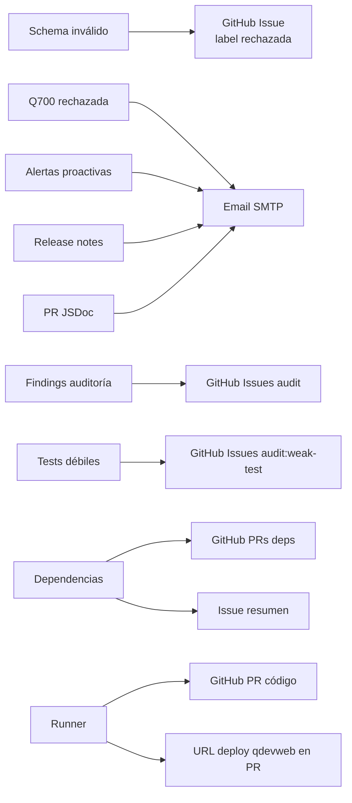

Canales:

- Email: rechazos Q700, alertas, release notes, PRs de documentación.
- GitHub Issues: rechazos de schema, auditoría, mutation testing, resumen de dependencias.
- GitHub PRs: código resuelto, documentación JSDoc, dependencias.
- PR body: URL de deploy preview cuando el runner completa build y despliegue.

## Ciclo de Vida Completo

```mermaid
flowchart LR
    A[1. DMS] --> B[2. Validación schema + Q700]
    B --> C[3. Issue GitHub]
    C --> D[4. Priorización]
    D --> E[5. Knowledge Base]
    E --> F[6. kiro-cli narobial-frontend]
    F --> G[7. Tests]
    G --> H[8. PR]
    H --> I[9. Deploy qdevweb]
    I --> J[10. Changelog + decisiones]
    J --> K[11. Release notes]
    K --> L[12. Alertas y mejora continua]
    L --> D
```

## Troubleshooting

### El servicio principal no arranca

Comprobar estado y logs:

```bash
sudo systemctl status symphony-agent.service
sudo journalctl -u symphony-agent.service -n 200 --no-pager
```

Checks:

- Node, npm y `npx` accesibles desde systemd.
- Working directory existe.
- `.env` presente y legible.
- `gh` autenticado para el usuario `gcalleja`.

### Faltan variables de entorno

Síntoma:

```text
Missing env var: <NAME>
```

Acción:

- Revisar `/home/gcalleja/code/symphony/agent/.env`.
- Comparar con `.env.example`.
- Reiniciar servicio si se modificó `.env`.

```bash
sudo systemctl restart symphony-agent.service
```

### DMS devuelve error

Síntoma:

```text
DMS error: <status>
```

Acción:

- Verificar `DMS_ACCESS_TOKEN`, `DMS_CLIENT_ID`, `DMS_SERVER_CODE`.
- Validar que `DMS_HEADERS` y `DMS_CUSTOM_INTERFACE` son JSON válidos.
- Confirmar que `DMS_SEARCH_VALUE` tiene incidencias abiertas.

### Se crean rechazos Q700

Síntoma:

- Email con asunto `[Symphony] Q700 rechazada`.

Acción:

- Revisar campos faltantes: país, marca, cliente o requisitos.
- Corregir contradicciones o descripciones genéricas en DMS.
- Volver a dejar la incidencia abierta para que el fetcher la recoja.

### `gh` falla creando issues, labels o PRs

Acción:

```bash
gh auth status
gh repo view "$GITHUB_REPO"
gh issue list -R "$GITHUB_REPO" --limit 5
```

Revisar:

- Token con permisos suficientes.
- Repo correcto en `GITHUB_REPO`.
- Labels e issue types disponibles.
- Usuario `REJECT_ASSIGNEE` existe y puede ser asignado.

### El solver no lanza agentes

Posibles causas:

- No hay issues abiertas.
- Todas las issues tienen labels excluidos: `agente-trabajando`, `rechazada`, `en-revision`, `done`.
- `MAX_CONCURRENT_AGENTS` ya está ocupado por issues en `running`.

Comando útil:

```bash
gh issue list -R "$GITHUB_REPO" --state open --json number,title,labels --limit 50
```

### Error creando rama en `runner.ts`

Posibles causas:

- La rama ya existe localmente.
- Hay cambios locales sin commitear en `FRONTEND_REPO_DIR`.
- `git pull --ff-only` no puede avanzar.

Acción:

```bash
cd /home/gcalleja/code/symphony/agent/repos/Narobial-Frontend
git status
git branch --list 'hotfix/*'
git fetch origin
```

No eliminar ramas ni cambios sin confirmar primero si pertenecen a un trabajo activo.

### `kiro-cli` falla

El runner continúa si `kiro-cli` sale con código distinto de 0, porque comprueba si hay commits posteriores.

Acción:

- Revisar stdout/stderr en `journalctl`.
- Confirmar que el agente existe:

```bash
kiro-cli agent list
kiro-cli agent set-default narobial-frontend
```

- Verificar que el repo frontend contiene `AGENTS.md` e `INSTRUCTIONS.md`.

### No se despliega a qdevweb

El deploy solo se ejecuta si hay commits entre `hotfix-master..HEAD`.

Checks:

- `npm run build-hotfix` existe en el frontend.
- `DEPLOY_HOST` resuelve desde el servidor.
- La clave `DEPLOY_SSH_KEY` permite `root@qdevweb.intraquiter`.
- Docker está disponible en qdevweb.
- Los archivos `dist/narobial`, `etc/default.conf`, `etc/nginx.crt`, `etc/nginx.key` existen.

### El auditor falla parseando JSON

Síntoma:

```text
No se encontró JSON en el output de kiro-cli
```

Acción:

- Revisar los primeros 2000 caracteres que imprime el error.
- Ajustar `audit-prompt.ts` si `kiro-cli` añade texto fuera del bloque JSON.
- Reejecutar manualmente:

```bash
npx tsx src/auditor.ts
```

### Mutation testing no genera report

Checks:

- Stryker instalado o resoluble con `npx stryker run`.
- Ruta esperada: `reports/mutation/mutation.json`.
- Tiempo suficiente: el timeout actual es 30 minutos.

Manual:

```bash
cd /home/gcalleja/code/symphony/agent/repos/Narobial-Frontend
npx stryker run
```

### Timers no se ejecutan

Acción:

```bash
systemctl list-timers 'symphony-*'
sudo systemctl status symphony-alerts.timer
sudo journalctl -u symphony-alerts.service -n 100 --no-pager
```

Revisar:

- Unit copiada en `/etc/systemd/system`.
- `systemctl daemon-reload` ejecutado.
- Timer habilitado con `enable --now`.
- Zona horaria del servidor.

## Operación Diaria

### Comandos de salud

| Objetivo | Comando |
| --- | --- |
| Ver servicio principal | `sudo systemctl status symphony-agent.service` |
| Seguir logs del loop | `sudo journalctl -u symphony-agent.service -f` |
| Ver timers | `systemctl list-timers 'symphony-*'` |
| Ejecutar alertas manualmente | `npx tsx src/alerts.ts` |
| Ejecutar changelog manualmente | `npx tsx src/changelog-generator.ts` |
| Ejecutar docs manualmente | `npx tsx src/docs-detector.ts` |
| Ejecutar dependencias manualmente | `npx tsx src/deps-checker.ts` |
| Ejecutar auditoría manualmente | `npx tsx src/auditor.ts` |
| Ejecutar mutator manualmente | `npx tsx src/mutator.ts` |

### Estados de issues

| Estado | Representación |
| --- | --- |
| Pendiente | Issue abierta sin labels de exclusión |
| En ejecución | `agente-trabajando` y/o `status:en-desarrollo` |
| Desarrollada | `status:desarrollado` |
| En revisión | `status:en-revision` |
| Rechazada schema | `rechazada` |
| Auditoría | `audit:*` |
| Test débil | `audit:weak-test` |
| Dependencias | `deps:update` |

## Consideraciones de Seguridad

- No versionar `.env` con tokens reales.
- Rotar cualquier secret detectado por `gitleaks`; eliminar del código no es suficiente si ya entró en historial.
- Revisar PRs de dependencias antes de mergear, especialmente cambios major o `npm audit fix` con impacto transitivo.
- El runner usa `--trust-all-tools`; por eso el repo objetivo y los prompts deben tratarse como superficie sensible.
- El deploy remoto ejecuta Docker como `root`; limitar acceso SSH y auditar claves.
- Las issues generadas por auditoría deben ser independientes y accionables para evitar cambios amplios.

## Límites Conocidos

- La priorización usa heurísticas simples sobre labels, título y longitud del body.
- La Knowledge Base usa coincidencia léxica local, no embeddings.
- El antiguo `docs-checker.ts` queda como implementación manual; el flujo operativo usa `docs-detector.ts`.
- `runner.ts` fija `hotfix-master` como base en el flujo principal.
- `notifier-email.ts` tiene remitente y destinatario hardcodeados.
- `install.sh` no instala todos los timers periódicos incluidos en `systemd/`.
